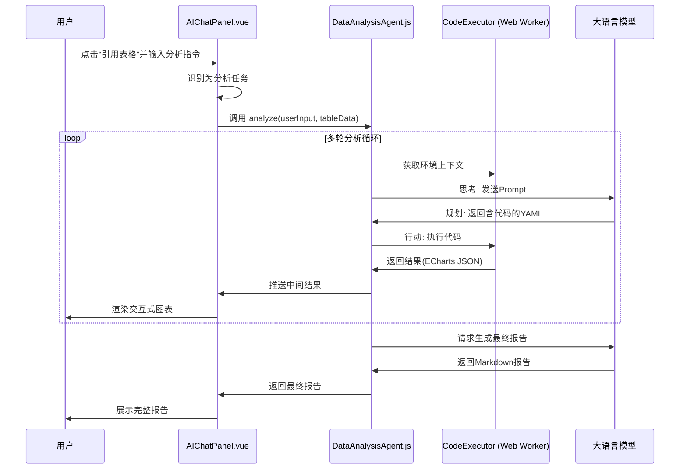

# WPS-AI 智能表格助手

## 1. 项目概述

WPS-AI 智能表格助手是一个为 WPS Office 表格 (ET) 程序开发的加载项插件。它基于 Vue.js 构建，并集成了大语言模型 (LLM) 的能力，旨在为用户提供智能化的表格数据处理、分析、可视化以及自然语言交互功能。

## 2. 主要功能

*   **AI 对话助手:**
    *   通过 WPS Ribbon UI 启动，在任务窗格中提供聊天界面。
    *   支持自然语言与 AI 对话，处理表格相关及通用问题。
    *   能够引用当前 WPS 表格的选定区域或已使用区域数据作为上下文。
    *   AI 可以根据指令和数据进行分析、总结、生成文本内容。
    *   支持流式输出，提供实时反馈。
*   **智能图表生成:**
    *   AI 可以根据用户请求和提供的表格数据，推荐并生成 ECharts 图表的 JSON 配置。
    *   生成的图表直接在聊天界面中渲染显示。
*   **LLM 配置管理:**
    *   提供图形化界面，允许用户添加、编辑、删除、切换和测试多个大语言模型服务配置（如通义千问、OpenAI GPT 系列、Claude 等）。
    *   支持配置的导入和导出。
*   **自定义 WPS 函数 (示例):**
    *   展示了如何向 WPS 表格中添加自定义 JavaScript 函数，用户可以在单元格公式中调用。
*   **通用应用设置:**
    *   管理应用的调试模式、特性开关等。

## 3. 技术栈

*   **前端框架:** Vue.js 3 (使用 Composition API 和 Options API)
*   **路由管理:** Vue Router (Hash 模式)
*   **构建工具:** Vite
*   **HTTP 客户端:** Axios (非流式请求), Fetch API (流式请求)
*   **图表库:** ECharts (按需引入)
*   **WPS Office 集成:**
    *   WPS JSAPI (JavaScript API for Office Add-ins)
    *   `wpsjs` (WPS 官方提供的 JS SDK 和 Vite 插件)
    *   `et-jsapi-declare` (WPS JS API 类型声明文件)
*   **语言模型接口:**
    *   主要设计为与兼容 OpenAI API 格式的 LLM 服务交互（如阿里云通义千问 DashScope）。
    *   通过配置管理器支持多种模型和服务。
*   **代码规范与格式化:** ESLint, Prettier

## 4. 项目结构

```
.
├── public/                      # 静态资源
│   ├── favicon.ico
│   ├── ribbon.xml               # WPS Ribbon UI 定义
│   └── images/                  # 图标资源
│       ├── 1.svg
│       ├── 2.svg
│       ├── 3.svg
│       └── newFromTemp.svg
├── src/                         # 项目源码
│   ├── assets/                  # CSS样式、SVG Logo等
│   ├── components/              # Vue 组件
│   │   ├── AIChatPanel.vue      # AI聊天面板核心UI
│   │   ├── ChartDisplay.vue     # ECharts图表渲染组件
│   │   ├── LLMConfigPanel.vue   # LLM配置管理面板UI
│   │   ├── Root.vue             # 加载项主导航/着陆页UI
│   │   └── js/                  # UI无关的JavaScript模块
│   │       ├── aiChatManager.js # 管理AI聊天任务窗格的显示/隐藏
│   │       ├── aiService.js     # 封装与LLM API的通信
│   │       ├── appConfigManager.js # 统一的配置管理器 (LLM配置 + 通用应用设置)
│   │       ├── functions.js     # 定义暴露给WPS表格的自定义函数
│   │       ├── markdownRenderer.js # Markdown到HTML的渲染逻辑
│   │       └── util.js          # 与WPS表格交互的工具函数 (数据读写等)
│   ├── router/                  # Vue Router配置
│   │   └── index.js
│   ├── App.vue                  # Vue根组件
│   └── main.js                  # Vue应用入口文件
├── .eslintrc.cjs                # ESLint 配置文件
├── .gitignore
├── .prettierrc.json             # Prettier 配置文件
├── index.html                   # 应用主HTML文件 (Vite入口)
├── jsconfig.json
├── manifest.xml                 # WPS加载项清单文件
├── package-lock.json
├── package.json                 # 项目依赖和脚本
└── vite.config.js               # Vite 构建配置文件
```

### 关键文件/目录说明:

*   **`manifest.xml`**: WPS 加载项的清单文件，定义插件ID、名称、描述、入口点、自定义函数等。
*   **`public/ribbon.xml`**: 定义了插件在 WPS Office Ribbon UI 上的自定义选项卡和按钮。
*   **`src/components/ribbon.js`**: (实际位于 `src/components/` 目录下，但其逻辑与 `public/ribbon.xml` 紧密相关) 包含WPS Ribbon UI事件的回调函数 (如 `OnAddinLoad`, `OnAction`)。
*   **`src/main.js`**: Vue 应用的入口，初始化Vue实例、Vue Router等。
*   **`src/router/index.js`**: 定义前端路由，目前主要有默认页 (`/`) 和AI聊天页 (`/ai-chat`)。
*   **`src/App.vue`**: Vue 应用的根组件，通常包含 `<RouterView />`。
*   **`src/components/AIChatPanel.vue`**: AI 聊天功能的核心UI和交互逻辑。
*   **`src/components/LLMConfigPanel.vue`**: 用于管理LLM配置的UI界面。
*   **`src/components/js/appConfigManager.js`**: 统一管理LLM服务配置和应用通用设置，支持本地持久化存储。
*   **`src/components/js/aiService.js`**: 负责与大语言模型API进行通信，支持流式和非流式请求。
*   **`src/components/js/aiChatManager.js`**: 使用WPS JSAPI创建和管理AI聊天界面的任务窗格。
*   **`src/components/js/util.js`**: 包含与WPS表格交互的实用函数，如读取单元格数据、将表格数据格式化为Markdown等。
*   **`vite.config.js`**: Vite的配置文件，包含WPS相关的构建插件，如 `functionsScanner` (用于处理自定义函数) 和 `copyFile` (用于复制 `manifest.xml`)。

## 5. 安装与运行

### 5.1 环境准备

*   Node.js (推荐LTS版本)
*   npm (通常随Node.js安装) 或 yarn
*   WPS Office 桌面版

### 5.2 安装依赖

首先，需要全局安装 `wpsjs` 开发工具:
```bash
npm install -g wpsjs
```

然后，在项目根目录下安装项目依赖：
```bash
npm install
# 或者
# yarn install
```

### 5.3 开发与调试

执行以下命令进行开发和调试：
```bash
wpsjs debug
```
该命令会自动处理开发服务器启动、插件打包和在WPS中加载等一系列操作，是推荐的开发方式。

### 5.4 构建生产版本

执行以下命令构建用于生产环境的优化版本：
```bash
npm run build
```
构建产物将输出到 `dist` 目录。

### 5.5 在WPS Office中加载插件

*   **开发时调试:**
    `wpsjs debug` 命令会自动完成此步骤，无需手动操作。

*   **加载构建后的本地插件:**
    1.  将 `npm run build` 生成的 `dist` 目录下的所有文件，连同项目根目录的 `manifest.xml` 和 `public/ribbon.xml` (如果构建脚本没有自动处理它们到dist目录) 打包成一个 `.zip` 文件。
    2.  将 `.zip` 文件后缀修改为 `.wpsaddon`。
    3.  在WPS表格中，通过 "开发工具" -> "JS加载项" -> "管理加载项" -> "从本地文件添加"，选择该 `.wpsaddon` 文件。
    4.  或者，将 `dist` 目录内容放置在WPS信任的本地目录，然后通过 "从文件夹添加" 的方式加载。

**注意:** 具体的加载步骤可能因WPS Office版本略有不同。请参考最新的WPS Office官方开发文档。

## 6. 核心工作流程

### 6.1 配置管理 (`appConfigManager.js`)

*   **统一管理:** `appConfigManager.js` 负责管理两类配置：
    1.  **LLM配置:** 多个LLM服务提供商的详细参数（API Key, URL, 模型名称等）。支持预设、用户自定义、导入/导出。
    2.  **通用应用设置:** 应用版本、调试模式、功能开关、UI参数等。
*   **持久化:** 所有配置都使用WPS的 `PluginStorage` (如果可用) 或浏览器的 `localStorage` 进行持久化。
*   **交互:** `LLMConfigPanel.vue` 提供UI与LLM配置进行交互。`aiService.js` 从 `appConfigManager` 获取当前激活的LLM配置用于API调用。

### 6.2 AI聊天与数据分析统一工作流

本项目将标准的AI聊天与强大的数据分析智能体无缝融合在同一个聊天界面中，提供统一、智能的交互体验。

1.  **启动与数据引用**: 用户在WPS中打开AI对话助手。通过点击“引用表格”按钮，将当前表格的选定区域或已使用区域数据加载到对话的上下文中。
2.  **意图识别**: 用户输入指令后，系统会进行简单的关键词判断（如“分析”、“图表”、“趋势”等）。
    *   **若为普通聊天**: 执行标准的问答流程。
    *   **若为数据分析请求**: 激活数据分析智能体。
3.  **智能体工作流 (ReAct模式)**:
    *   **数据准备**: `AIChatPanel.vue` 调用 `util.js` 中的 `getTableContextData(true)` 获取原始JSON格式的表格数据。
    *   **启动智能体**: `AIChatPanel.vue` 实例化 `DataAnalysisAgent` 并调用其 `analyze` 方法，传入用户指令和原始数据。
    *   **循环分析**: `DataAnalysisAgent` 开始执行其核心的“思考-编码-执行”循环：
        1.  **思考 (Reason)**: `DataAnalysisAgent` 获取 `CodeExecutor` (Web Worker) 中的当前环境状态（如已加载的DataFrame信息），结合对话历史，构建一个详细的系统提示词（Prompt）发送给大语言模型（LLM）。
        2.  **规划 (Plan)**: LLM 返回一个包含下一步行动规划和JavaScript代码的YAML格式响应。
        3.  **行动 (Act)**: `DataAnalysisAgent` 解析响应，并将JS代码发送给 `CodeExecutor`。
        4.  **执行**: `CodeExecutor` 在其隔离的Web Worker环境中安全地执行代码（使用Danfo.js进行数据处理）。
        5.  **结果反馈**: Worker将执行结果（如计算出的统计值，或用于生成图表的ECharts JSON配置对象）返回给`DataAnalysisAgent`。
        6.  **UI更新与循环**: `DataAnalysisAgent` 将中间结果（如ECharts配置）实时推送给 `AIChatPanel.vue` 进行渲染，并将执行反馈加入对话历史，然后开始下一轮循环，直到分析任务完成。
    *   **报告生成**: 所有分析步骤完成后，`DataAnalysisAgent` 会要求LLM根据全部分析过程生成一份最终的Markdown报告。
4.  **结果呈现**:
    *   **中间结果**: 在分析的每一轮，如果生成了图表配置，`AIChatPanel.vue` 会立刻使用ECharts组件将其渲染为交互式图表，展示在当前对话中。
    *   **最终结果**: 最终的Markdown分析报告会被格式化后，完整地显示在AI的最后一条消息中。



### 6.3 WPS Office集成

*   **Ribbon UI:**
    *   `public/ribbon.xml` 定义了在WPS Ribbon上添加的 "AI智能助手" 选项卡和 "AI对话助手" 按钮。
    *   `src/components/ribbon.js` 提供了 `onLoad` (插件加载时执行) 和 `onAction` (按钮点击时执行) 等回调函数，连接UI与业务逻辑。
*   **任务窗格:**
    *   `src/components/js/aiChatManager.js` 使用 `window.Application.CreateTaskPane()` API创建和管理一个WPS任务窗格，用于嵌入AI聊天界面的Vue应用。
*   **自定义函数:**
    *   `src/components/js/functions.js` 中使用JSDoc `@customfunction` 标记定义的函数 (如 `custom_function`)。
    *   `vite.config.js` 中的 `functionsScanner` 插件会扫描此文件，生成 `functions.json`。
    *   `manifest.xml` 引用 `functions.json`，使得这些函数可以在WPS表格单元格中通过 `=HelloEt.functionName()` 的形式调用。

## 7. 开发注意事项

*   **代码风格:** 项目使用ESLint进行代码规范检查，使用Prettier进行代码格式化。请在提交代码前确保通过检查和格式化。
    *   `npm run lint`: 执行ESLint检查和自动修复。
    *   `npm run format`: 执行Prettier格式化。
*   **调试:**
    *   Vue Devtools 浏览器扩展可用于调试Vue组件状态和事件。
    *   WPS Office 提供了JS加载项的调试工具 (通常通过右键点击任务窗格选择 "检查" 或类似选项打开开发者工具)。
    *   `console.log` 语句在代码中广泛用于输出调试信息。
*   **API Keys:** LLM API Key是敏感信息。在 `appConfigManager.js` 的预设配置中，除了用户明确要求保留的开发测试用Key外，其他API Key字段应为空。用户需要通过 `LLMConfigPanel.vue` 自行配置有效的API Key。
*   **WPS JSAPI:** 开发时请密切参考WPS Office官方的JS API文档，以了解API的最新用法和限制。

## 8. 未来展望 (示例)

*   实现 `Root.vue` 中曾规划的其他功能模块，如 "AI智能面板"、"AI智能体管理" 等。
*   增强表格数据的双向交互能力（例如，AI直接修改表格内容）。
*   支持更丰富的图表类型和自定义选项。
*   优化性能和用户体验。

---

祝您开发愉快！
